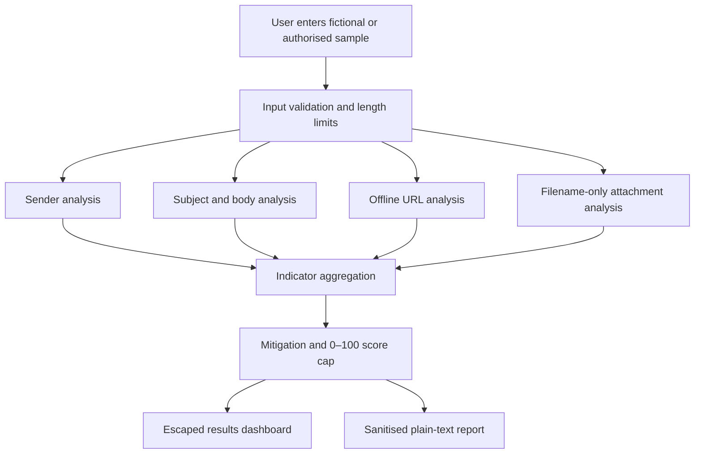

# PROJECT REPORT

## 1. Title

**Mini Project 1: Phishing Mail**

**PhishGuard — Phishing Email Detection and Awareness Tool**

## 2. Abstract

Phishing emails use deceptive identities, emotional pressure, misleading links,
and risky attachments to persuade recipients to perform unsafe actions.
PhishGuard is a local educational web application that analyses manually
entered, fictional or authorised email samples. It applies transparent rules to
sender details, subject text, body content, URLs, and attachment filenames. Each
detected indicator contributes defined risk points and includes an explanation
and defensive recommendation. The score is capped at 100 and mapped to Low
Risk, Suspicious, High Risk, or Critical Phishing Risk.

The project is designed for safe classroom demonstration. It does not send
email, connect to accounts, visit websites, resolve domains, upload files,
execute attachments, collect credentials, or store analysis history. Its
purpose is awareness and risk assessment rather than production-grade threat
detection.

## 3. Introduction

Email is an important communication method for education, business, banking,
and personal services. Its familiar format can also be abused by attackers who
pretend to represent a trusted person or organisation. A fraudulent message may
combine a believable sender name with urgency, threats, rewards, credential
requests, a misleading URL, or a dangerous attachment.

Technical security controls are important, but user awareness remains necessary
because a recipient must often judge an unexpected request. A learning tool is
most useful when it explains why an item is suspicious instead of showing only
a final label. PhishGuard therefore uses an explainable rule-based method that a
student can trace during a demonstration or viva.

## 4. Problem Statement

Many learners know that phishing is dangerous but find it difficult to identify
the individual warning signs inside a realistic message. Existing production
security products can be complex, depend on live network intelligence, and hide
their decision logic. A college mini project requires a simple, safe, and
transparent system that demonstrates phishing analysis without introducing
offensive functionality or interacting with real targets.

## 5. Objectives

The main objectives are:

1. To accept manually entered fictional or authorised email details.
2. To identify common sender, language, URL, and filename warning signs.
3. To assign readable and configurable risk points.
4. To classify the total score into four understandable categories.
5. To explain every detected indicator and recommend a defensive response.
6. To teach phishing-prevention and incident-response habits.
7. To create a safe downloadable analysis report.
8. To demonstrate secure input handling and output escaping in Flask.
9. To remain fully local and avoid email, network, and file-execution activity.

## 6. Scope

The project scope includes:

- sender display name and sender-address text;
- recipient text for greeting comparison;
- subject and body phrase analysis;
- generic and personalised greeting checks;
- requests for passwords, OTPs, PINs, banking data, card data, and identity data;
- urgency, threats, secrecy, emotional pressure, rewards, and unsafe prompts;
- offline parsing of a manually entered URL;
- comparison of a displayed link and actual destination;
- filename extension and double-extension checks;
- component and overall scoring;
- awareness guidance and fictional samples; and
- a sanitised plain-text report.

The scope excludes inbox connection, email authentication protocols, live domain
reputation, HTTP requests, DNS resolution, website scanning, attachment-content
inspection, credential collection, and automated security enforcement.

## 7. Technologies Used

| Area | Technology | Purpose |
|---|---|---|
| Programming language | Python 3 | Analysis, validation, routing, reporting |
| Web framework | Flask | Local web application and Jinja rendering |
| Frontend | HTML5 | Semantic page structure and forms |
| Styling | CSS3 | Responsive cybersecurity dashboard |
| Interaction | JavaScript | Consent control, sample loading, loading state |
| URL parsing | `urllib.parse` | Offline scheme, host, path, port, query parsing |
| IP validation | `ipaddress` | Numeric destination detection |
| Testing | pytest | Automated unit verification |
| Data format | JSON | Fictional sample email library |
| Report format | Plain text | Safe, non-executable download |

No database is required because the application does not store analysis
history.

## 8. System Architecture

PhishGuard follows a modular, server-rendered architecture.



The presentation layer contains Jinja templates and static assets. The Flask
application layer handles routes, fixed sample selection, validation, response
headers, and report delivery. The analysis layer contains independent modules
that return consistent indicator dictionaries. The data layer contains only
fixed fictional JSON samples; there is no persistent user-data layer.

## 9. Methodology

The methodology is deterministic and rule-based:

1. Known form fields are trimmed and limited to a documented maximum length.
2. The server verifies that the safety checkbox was submitted and that at least
   one meaningful field is present.
3. Email address text is parsed and checked for missing, malformed, suspicious,
   or inconsistent identity patterns.
4. Subject and body content are converted only for comparison; the original
   text remains untrusted and is never rendered without escaping.
5. Phrase groups are matched case-insensitively. Each group produces at most
   one indicator, avoiding repeated points for the same rule.
6. The URL is parsed with Python's standard library. No network operation is
   performed.
7. The attachment filename is reduced to a basename and its suffixes are
   inspected. No file is accepted.
8. Indicator points are summed. A matching personalised greeting may subtract
   three points.
9. The final score is restricted to the inclusive range 0–100.
10. The results page displays labels, points, evidence, recommendations, and
    limitations.
11. Report generation repeats the same validation and analysis so that no
    analysis history or server-side report file is required.

## 10. Detection Rules

### 10.1 Sender rules

- missing or malformed sender address;
- claimed organisation not reflected in the domain;
- suspicious numbers, hyphens, or security-themed domain structure;
- free email provider combined with a company-style sender name;
- personal display name inconsistent with the mailbox name; and
- excessive suspicious subdomain structure.

### 10.2 Subject and body rules

- urgent or threatening words;
- artificial deadlines;
- generic greetings;
- password, credential, recovery-code, OTP, or PIN requests;
- banking, card, or personal-information requests;
- instructions to open an attachment;
- account-suspension threats;
- prize, lottery, or unrealistic financial claims;
- excessive capital letters or exclamation marks;
- requests to bypass security controls;
- pressure to keep the action secret;
- emotional manipulation;
- multiple grammar warning patterns; and
- unsolicited click prompts.

### 10.3 URL rules

- HTTP instead of HTTPS;
- IP address instead of domain;
- excessive length;
- recognised shortening pattern;
- excessive subdomains;
- @ symbol in the authority section;
- encoded or unusual characters;
- possible 0/1 look-alike substitution;
- hyphen-heavy hostname;
- suspicious filename extension in the path;
- Punycode prefix;
- non-standard port;
- redirect-like query parameters;
- security-sensitive URL words; and
- mismatch between displayed and actual hostname.

### 10.4 Attachment-filename rules

- executable, script, shortcut, installer, or image-mount extensions;
- compressed archive extensions;
- macro-enabled Office formats; and
- deceptive double extensions such as `invoice.pdf.exe`.

The checker analyses only the entered filename. It does not upload, open,
extract, scan, download, or execute a file.

## 11. Risk-Scoring Algorithm

Each rule has a named numeric weight. Important high-risk requests receive
larger values because disclosure could directly enable account or financial
harm.

Examples of the main weights are:

| Rule | Points |
|---|---:|
| Urgent or threatening language | 10 |
| Generic greeting | 5 |
| Password request | 25 |
| OTP or PIN request | 25 |
| Banking or card-data request | 25 |
| Personal-information request | 15 |
| Suspicious sender domain | 15 |
| Displayed-link mismatch | 20 |
| HTTP URL | 5 |
| IP-based URL | 15 |
| Punycode domain | 15 |
| Executable attachment | 25 |
| Macro-enabled attachment | 15 |
| Double-extension attachment | 25 |
| Account-suspension threat | 15 |

The algorithm can be expressed as:

```text
raw_score = sum(points of every triggered indicator)
adjusted_score = raw_score - personalised_greeting_mitigation
final_score = min(100, max(0, adjusted_score))
```

The category mapping is:

- **0–24:** Low Risk
- **25–49:** Suspicious
- **50–74:** High Risk
- **75–100:** Critical Phishing Risk

The model is heuristic. The score is an educational estimate, not a probability
and not a definitive verdict.

## 12. Modules

### 12.1 Email Input Module

`templates/index.html` provides fields for sender, recipient, subject, body,
displayed link, actual URL, and attachment filename. The Analyse button remains
disabled until the safety confirmation is selected.

### 12.2 Main Analysis Module

`analyzer.py` defines content and sender rules, the readable risk-weight
dictionary, risk-category mapping, personalised greeting mitigation, component
totals, and final aggregation.

### 12.3 URL Inspection Module

`url_analyzer.py` uses only standard string processing, `urllib.parse`, and
`ipaddress`. It returns the parsed hostname, points, level, and rule records.

### 12.4 Attachment Risk Module

`attachment_analyzer.py` uses `PurePath` suffix parsing to classify the filename
as Low, Medium, High, or Critical.

### 12.5 Utility Module

`utils.py` contains field limits, normalisation, validation, phrase matching,
safe highlighting, plain-text sanitisation, and filename sanitisation.

### 12.6 Report Module

`report_generator.py` produces a text report in memory. It includes metadata,
time, score, findings, explanations, actions, and a disclaimer.

### 12.7 Presentation Module

The templates display the input, results, awareness, and project-information
pages. `style.css` provides the responsive visual system, while `script.js`
provides consent gating, sample loading, character counting, navigation, and a
loading state.

### 12.8 Sample Library

Three fixed JSON files demonstrate Low Risk, Suspicious, and Critical Phishing
Risk cases. Every organisation is fictional and every hostname uses a reserved
domain or documentation IP range.

## 13. Input and Output

### Input

The system accepts manually typed text:

- sender name and sender email address;
- recipient name or email;
- subject and body;
- displayed link text and actual URL text;
- attachment filename; and
- required safety confirmation.

The system does not accept a mailbox login, password, OTP, payment field, file
upload, raw network connection, or email-account authorisation.

### Output

The output includes:

- final score and risk category;
- number of detected indicators;
- sender, content, URL, and attachment component risks;
- triggered rule names and point contributions;
- explanations and defensive actions;
- safely highlighted suspicious body phrases;
- general safe-behaviour advice;
- educational disclaimer; and
- optional plain-text report.

## 14. Test Cases

Automated tests are divided by responsibility.

| Test area | Representative expected result |
|---|---|
| Urgent keyword | Urgency rule triggered |
| Case variation | Same phrase matched regardless of case |
| Generic greeting | Greeting warning triggered |
| Password request | 25-point credential rule triggered |
| OTP request | Independent 25-point OTP/PIN rule triggered |
| Missing input | Analysis completes without exception |
| Personalised greeting | Three-point mitigation applied |
| HTML in body | Tags escaped before highlight markup |
| Excessive punctuation | Formatting warning triggered |
| HTTP URL | HTTP indicator triggered |
| IP URL | Numeric-destination indicator triggered |
| Deep subdomain | Excessive-subdomain indicator triggered |
| Link mismatch | 20-point mismatch rule triggered |
| Related subdomain | No false mismatch for related hostnames |
| Punycode | Punycode indicator triggered |
| Non-standard port | Port warning triggered |
| Redirect parameter | Redirect warning triggered |
| Empty URL | Zero URL points |
| Executable extension | High-risk attachment indicator |
| Double extension | Critical filename classification |
| Macro document | Medium filename classification |
| Archive | Medium filename classification |
| Safe PDF | Low filename classification |
| Score boundaries | Correct four-band mapping |
| Score overflow | Final score capped at 100 |
| Component totals | Equal category indicator sums |

The complete suite can be run with `pytest` from the project directory.

## 15. Results

The completed system provides a consistent, explainable result for each entered
sample. A normal fictional course notice produces a Low Risk result because the
sender and URL agree and no configured warning phrase is present. A fictional
document message with a link mismatch and archive produces a Suspicious result.
An obvious fictional phishing sample produces a Critical Phishing Risk result
because multiple independent sender, content, URL, and filename rules combine
and the final total reaches the cap.

These results show the intended educational principle: one minor warning does
not necessarily determine the result, while several strong and independent
signals rapidly increase the risk score.

## 16. Security Considerations

The implementation applies the following safeguards:

- POST is used for analysis and report requests.
- Known inputs have explicit length limits.
- Flask request size is limited.
- Jinja auto-escaping is retained for untrusted values.
- Suspicious-body highlighting escapes every original text segment before
  adding known `<mark>` elements.
- Sample identifiers use a fixed allowlist and cannot select arbitrary paths.
- Reports use sanitised values and conservative filenames.
- Reports are returned in memory and do not expose server paths.
- Security headers restrict scripts, styles, framing, referrers, and MIME
  interpretation.
- Responses are marked `no-store`.
- The default server binds only to `127.0.0.1`.
- Debug mode is disabled unless explicitly enabled by environment variable.
- No production secret is present in source.
- No history, credentials, tracking, analytics, uploads, or network analysis is
  implemented.

## 17. Limitations

1. Keyword rules cannot fully interpret meaning or context.
2. New phishing wording may not match the configured phrases.
3. Legitimate urgent messages may receive warning points.
4. A well-written phishing email may avoid several visible indicators.
5. No email-header authentication or routing information is available.
6. No live reputation, certificate, redirect, or domain-age information is
   checked.
7. Attachment contents cannot be inspected from a filename.
8. A displayed URL entered incorrectly can affect mismatch analysis.
9. English-language rules provide limited coverage of other languages.
10. The score is not a statistical probability.

## 18. Future Scope

Defensive future improvements may include:

- analysis of redacted, locally pasted header text;
- additional language-specific phrase groups;
- instructor-managed fictional classroom sample packs;
- configuration files for rule weights;
- synthetic-data calibration and false-positive measurement;
- expanded accessibility and usability evaluation;
- safe PDF report output;
- comparison exercises that ask learners to justify findings; and
- local-only import of sanitised `.eml` text with strict removal of attachments.

Future work must continue to exclude email delivery, real-brand cloning,
credential collection, live phishing infrastructure, URL scanning, attachment
execution, tracking, evasion, or any offensive campaign capability.

## 19. Conclusion

PhishGuard meets the goal of a simple but complete cybersecurity awareness mini
project. It demonstrates modular Flask development, secure handling of
untrusted text, standard-library URL parsing, filename risk analysis,
explainable scoring, responsive interface design, safe reporting, and automated
testing. Most importantly, it teaches users to slow down, examine multiple
signals, verify independently, and treat automated scores as guidance rather
than certainty.

## 20. References

1. National Institute of Standards and Technology, *Digital Identity
   Guidelines: Authentication and Lifecycle Management*, NIST SP 800-63B.
2. Cybersecurity and Infrastructure Security Agency, *Recognize and Report
   Phishing*.
3. OWASP Foundation, *Cross Site Scripting Prevention Cheat Sheet*.
4. Python Software Foundation, *urllib.parse — Parse URLs into components*,
   Python Standard Library Documentation.
5. Pallets Projects, *Flask Documentation*.
6. Internet Assigned Numbers Authority, *Special-Use Domain Names* and
   documentation address ranges.

These references provide background for authentication safety, phishing
awareness, output encoding, URL parsing, web application development, and safe
fictional test data.
