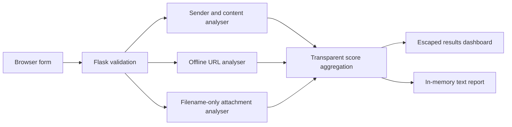

# PhishGuard — Phishing Email Detection and Awareness Tool

## Project overview

PhishGuard is a local Flask web application created for **Mini Project 1:
Phishing Mail**. It helps learners examine the visible structure of a fictional
or authorised email and understand common phishing warning signs.

The application uses readable, rule-based checks instead of a hidden machine
learning model. Every finding shows its points, explanation, and recommended
defensive action. Submitted URLs are parsed strictly as text, attachment checks
use only a typed filename, and analysis history is not stored.

> **Educational disclaimer:** PhishGuard is an awareness and risk-assessment
> tool. It is not production-grade detection and cannot guarantee that an email
> is safe or malicious.

## Problem statement

Phishing succeeds partly because urgent, authoritative, or emotionally charged
messages can persuade readers to act before checking the sender, link, request,
or attachment. Learners need a safe way to see how these indicators combine
without sending messages, interacting with real victims, or visiting suspicious
websites.

## Objective

The project provides a safe teaching environment that:

- accepts only manually entered email text and metadata;
- detects common social-engineering and technical warning signs;
- produces a transparent 0–100 heuristic risk score;
- explains every triggered rule and its recommended response;
- demonstrates offline URL and attachment-filename inspection;
- provides awareness guidance and fictional examples; and
- creates a safe, non-executable plain-text report.

## Features

- Sender name, address, recipient, subject, body, link, URL, and filename input
- Mandatory fictional/harmless/authorised confirmation
- Case-insensitive content and subject rules
- Generic and personalised greeting analysis
- Sensitive-information request detection
- Offline URL parsing with no HTTP or DNS activity
- Filename-only attachment risk classification
- Transparent overall and component scores
- Accessible colour-and-text risk dashboard
- Safely escaped suspicious-phrase highlighting
- Three fictional samples using reserved domains
- Awareness, response, and project-information pages
- Downloadable plain-text report generated in memory
- Input length limits, auto-escaping, security headers, and no history
- Pytest unit suite covering all required rule groups

## Technologies used

- **Frontend:** HTML5, CSS3, modern JavaScript
- **Backend:** Python 3 and Flask
- **Templates:** Jinja
- **URL handling:** Python `urllib.parse` and `ipaddress`
- **Testing:** pytest
- **Storage:** none

No database, external API, SMTP service, analytics library, or URL-fetching
dependency is used.

## Folder structure

```text
phishguard/
├── app.py
├── analyzer.py
├── url_analyzer.py
├── attachment_analyzer.py
├── report_generator.py
├── utils.py
├── requirements.txt
├── README.md
├── PROJECT_REPORT.md
├── .gitignore
├── templates/
│   ├── base.html
│   ├── index.html
│   ├── result.html
│   ├── awareness.html
│   └── about.html
├── static/
│   ├── css/
│   │   └── style.css
│   ├── js/
│   │   └── script.js
│   └── images/
│       └── README.txt
├── samples/
│   ├── legitimate_email.json
│   ├── phishing_email.json
│   └── suspicious_email.json
├── reports/
│   └── .gitkeep
└── tests/
    ├── test_analyzer.py
    ├── test_url_analyzer.py
    ├── test_attachment_analyzer.py
    └── test_scoring.py
```

## Architecture



The browser provides presentation and convenience interactions. Flask handles
validation and page routing. Independent Python modules produce indicator
records with a rule identifier, category, points, explanation, and recommended
action. The main analyser merges these records and caps the final score.

## Installation

### 1. Open the project directory

```bash
cd phishguard
```

### 2. Create a virtual environment

```bash
python -m venv venv
```

### 3. Activate the environment

Windows Command Prompt:

```bat
venv\Scripts\activate
```

Windows PowerShell:

```powershell
.\venv\Scripts\Activate.ps1
```

macOS/Linux:

```bash
source venv/bin/activate
```

### 4. Install dependencies

```bash
python -m pip install -r requirements.txt
```

## How to run the application

```bash
python app.py
```

Open the local address printed by Flask, normally:

```text
http://127.0.0.1:5000
```

The default host is loopback-only. Optional configuration values are:

- `PHISHGUARD_HOST` — listening host; default `127.0.0.1`
- `PHISHGUARD_PORT` — local port; default `5000`
- `PHISHGUARD_DEBUG` — set to `1` only for local development
- `PHISHGUARD_MAX_CONTENT_LENGTH` — maximum POST body in bytes
- `PHISHGUARD_SECRET_KEY` — optional environment-provided Flask secret

No production secret is included in source code.

## How to run tests

From the `phishguard` directory:

```bash
pytest
```

For a concise report:

```bash
pytest -q
```

## Email-analysis workflow

1. The user manually enters fictional or authorised sample data.
2. Client-side JavaScript keeps **Analyse Email** disabled until the safety
   confirmation is selected.
3. Flask repeats the confirmation check, validates field lengths, and requires
   at least one meaningful input.
4. Sender rules inspect the visible name, mailbox, and domain text.
5. Content rules inspect the subject, greeting, body language, and requests.
6. The URL module parses the entered URL with the standard library. It never
   opens, resolves, follows, pings, scans, or submits to the URL.
7. The attachment module inspects only the filename and its suffixes.
8. Triggered rules are merged, a personalised-greeting mitigation may subtract
   three points, and the result is capped from 0 to 100.
9. The dashboard displays the category, component totals, evidence,
   explanations, actions, safely highlighted text, and disclaimer.
10. A report request repeats validation and analysis, then returns a sanitised
    plain-text download without writing analysis history to disk.

## Risk-scoring system

The main weights are stored in the readable `RISK_WEIGHTS` dictionary in
`analyzer.py`. URL and attachment modules have similarly named dictionaries.

| Indicator | Points |
|---|---:|
| Urgent or threatening language | +10 |
| Generic greeting | +5 |
| Password or recovery-secret request | +25 |
| OTP or PIN request | +25 |
| Banking or card request | +25 |
| Personal-information request | +15 |
| Suspicious sender domain | +15 |
| Free provider used by company-style sender | +10 |
| Displayed-link mismatch | +20 |
| HTTP URL | +5 |
| IP-based URL | +15 |
| URL shortener | +10 |
| Punycode domain | +15 |
| Excessive subdomains | +10 |
| Executable or active attachment | +25 |
| Macro-enabled attachment | +15 |
| Deceptive double extension | +25 |
| Prize or lottery claim | +15 |
| Account-suspension threat | +15 |
| Excessive capitalisation or punctuation | +5 |

Smaller supporting rules are also visible in `analyzer.py` and on the About
page. They cover attachment prompts, artificial deadlines, click prompts,
secrecy, security bypassing, emotional manipulation, malformed URLs, redirects,
non-standard ports, suspicious URL extensions, archives, and similar warning
signs.

A greeting that matches the entered recipient subtracts **3 points**. This is a
small mitigation only; names are easy to obtain and it never marks a message as
safe by itself.

| Final score | Category |
|---:|---|
| 0–24 | Low Risk |
| 25–49 | Suspicious |
| 50–74 | High Risk |
| 75–100 | Critical Phishing Risk |

The sum is capped at 100. Component totals remain visible for explanation and
may exceed the range of the final meter.

## Example screenshots

Add screenshots after running the project locally:

1. `docs/screenshots/home-analysis-form.png` — analysis form and sample library
2. `docs/screenshots/critical-results-dashboard.png` — fictional phishing result
3. `docs/screenshots/awareness-guide.png` — prevention and incident steps

These are documentation placeholders only; no real company logos or messages
should be used.

## Safety and ethical limitations

PhishGuard deliberately:

- does not send or receive email;
- does not connect to any email account;
- does not accept passwords, OTPs, or credential submissions;
- does not create login pages or imitate real companies;
- does not upload, download, open, or execute attachments;
- does not make HTTP requests, perform DNS resolution, or scan websites;
- does not create phishing templates or campaigns;
- does not track users, add analytics, or retain analysis history;
- uses only fictional sample organisations and reserved domains; and
- produces a non-executable plain-text report.

Use the tool only with fictional, harmless, or explicitly authorised material.
Do not paste sensitive personal or authentication information.

## Known limitations

- Rules can produce false positives and false negatives.
- The application cannot inspect email headers, authentication records,
  message routing, live domain reputation, or attachment contents.
- Keyword rules do not fully understand context, sarcasm, or every language.
- URL rules use visible string structure and do not determine the final
  destination behind a redirect.
- Reserved-domain sample results demonstrate concepts rather than real threat
  intelligence.
- A low score means only that configured rules found few warning signs.

## Future improvements

Safe future work could include:

- optional parsing of locally supplied, redacted email-header text;
- user-selectable rule profiles for different classroom exercises;
- internationalised awareness content and phrase dictionaries;
- score calibration using a fully synthetic teaching dataset;
- accessibility testing with additional assistive technologies;
- export to a carefully sanitised PDF; and
- instructor-authored, fictional sample packs.

Future versions should preserve the existing prohibition on email sending,
credential collection, live URL access, file execution, tracking, and offensive
phishing functionality.

## Educational disclaimer

This project demonstrates defensive awareness concepts for coursework. It does
not replace organisational security procedures, trained incident responders,
email-security gateways, endpoint protection, or professional investigation.
When a real message is in doubt, avoid interacting with it and follow the
organisation's approved reporting process.
